# Selenium自动化测试

> 案例：手工方式执行具体步骤：
>
> 1. 打开 Chrome 浏览器，输入百度的网址www.baidu.com
> 2. 在搜索输入框中输入关键词“笨小鱼”并按下回车键；
> 3. 验证搜索结果页面的标题是否是“笨小鱼_百度搜索”。

## 一、配置测试环境

### 1、安装 Chrome Driver

> 注意：Chrome Driver 要和Chrome 浏览器版本相同，否则不起作用。

[Chrome Driver下载链接1](http://chromedriver.storage.googleapis.com/index.html)
[Chrome Driver下载链接2](https://npm.taobao.org/mirrors/chromedriver/)
[Chrome Driver下载链接3](https://www.newbe.pro/Mirrors/Mirrors-ChromeDriver/)

```bash
# 查看Chrome浏览器版本
chrome://version/

# 下载对应版本Chrome Driver

# 配置环境变量cmd输入
SystemPropertiesAdvanced.exe

# 配置Chrome Driver ：双击用户变量PATH，添加存放chromedriver.exe的文件位置
E:\ProgramFiles\ChromeDriver

# cmd查看是否安装成功
chromedriver
```

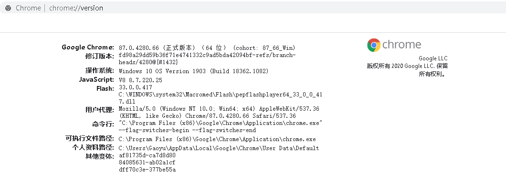
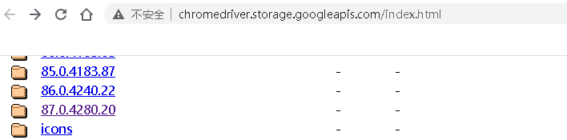
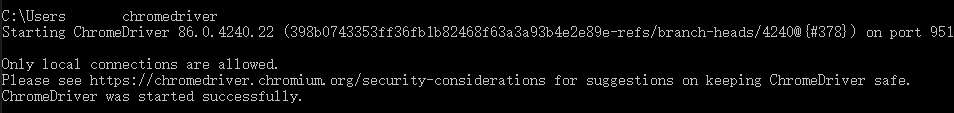

### 2、安装 Maven

[Maven下载链接](http://maven.apache.org/download.cgi)

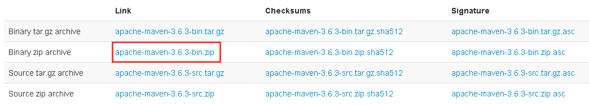

```bash
# 添加系统环境变量MAVEN_HOME
变量值为Maven安装路径 D:\Java\jdk1.8.0_231\jre

#  找到Path在环境变量值尾部加入(注意分号)
;%MAVEN_HOME%\bin

# 查看是否安装成功
mvn -v
```

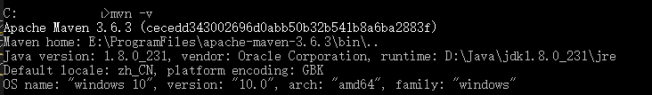

## 二、创建项目

### 1、创建空的Maven项目

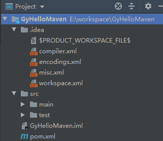

### 2、添加dependency

```bash
在 POM 文件中加入Selenium 2.0 及 junit 3.8.2 的依赖
查找对应版本将dependency复制到dependency中
添加完依赖后点右上角加载进去即可
```

[查找dependency链接https://mvnrepository.com/](https://mvnrepository.com/)

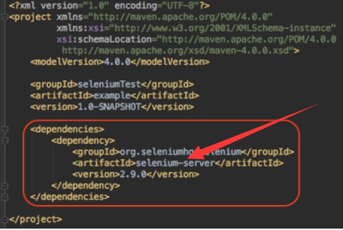
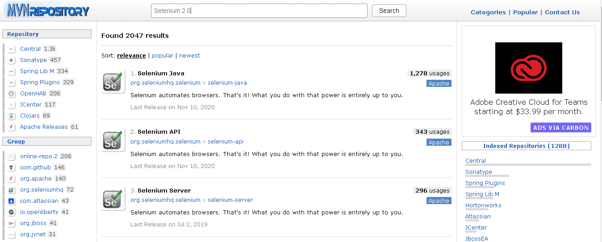
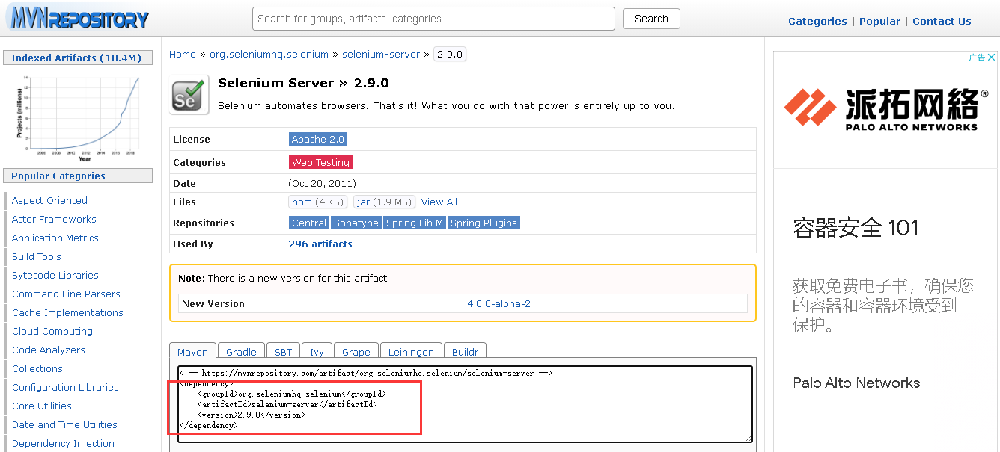
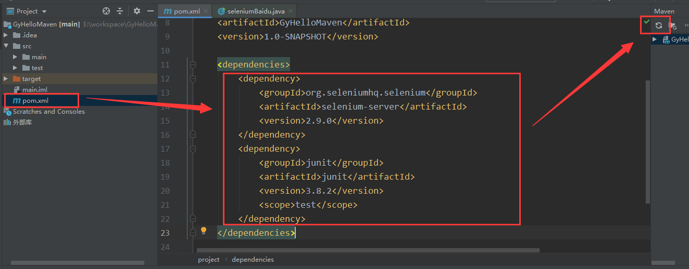

### 3、创建main函数

```java
// test目录下新建一个main函数，文件名和函数名保持一致（最好建一个包放进去，target文件自动生成）

import junit.framework.Assert;
import org.openqa.selenium.By;
import org.openqa.selenium.WebDriver;
import org.openqa.selenium.WebElement;
import org.openqa.selenium.chrome.ChromeDriver;


public class seleniumBaidu {
    public static void main(String[] args) throws InterruptedException {
        WebDriver driver = new ChromeDriver();

        driver.navigate().to("http://www.baidu.com");

        WebElement search_input = driver.findElement(By.name("wd"));
        // 在搜索输入框中输入搜索关键字“极客时间”
        search_input.sendKeys("笨小鱼");

        // 递交搜索请求
        search_input.submit();

        // 等待固定时间3秒
        Thread.sleep(3000);

        // 验证搜索结果页面的标题
        Assert.assertEquals("笨小鱼_百度搜索", driver.getTitle());

        driver.quit();
    }
}
```

### 4、运行main函数

> 效果：
> 1、这段代码会自动在你的电脑上打开 Chrome 浏览器；
> 2、在 URL 栏自动输入“www.baidu.com”；
> 3、百度主页打开后，在输入框自动输入“笨小鱼”并执行搜索；
> 4、返回搜索结果页面；
> 5、Chrome 浏览器自动退出。

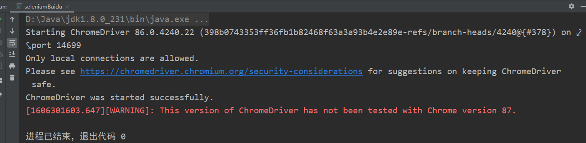
