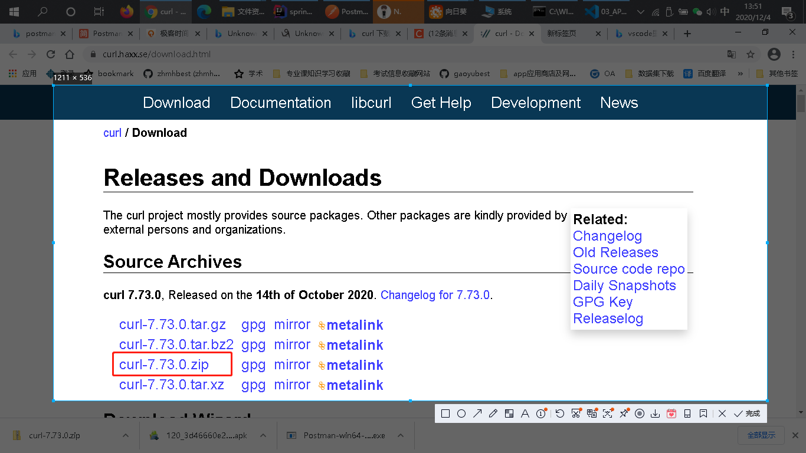
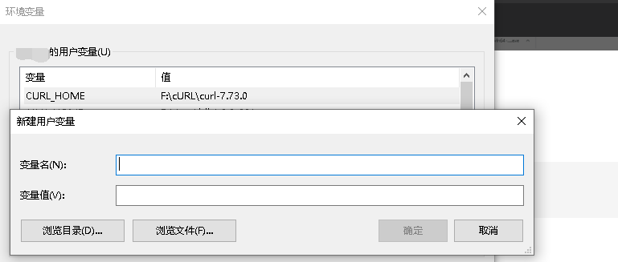
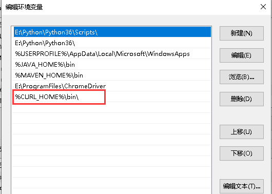
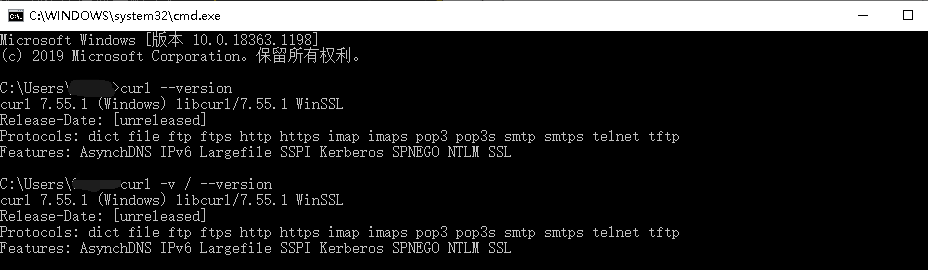
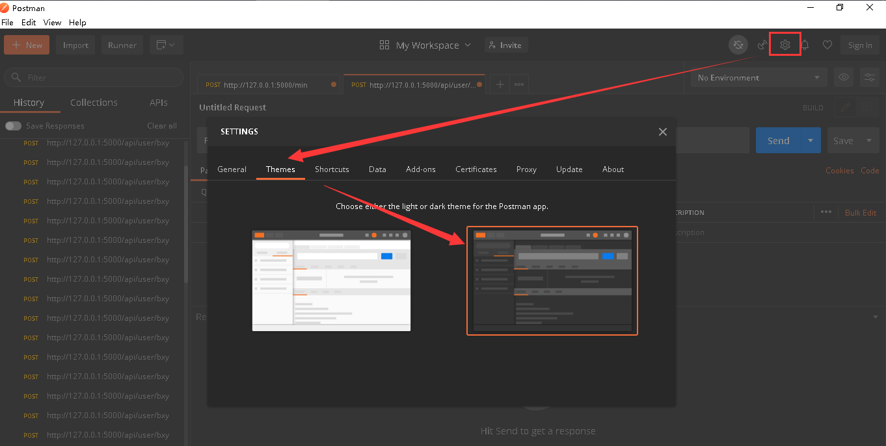
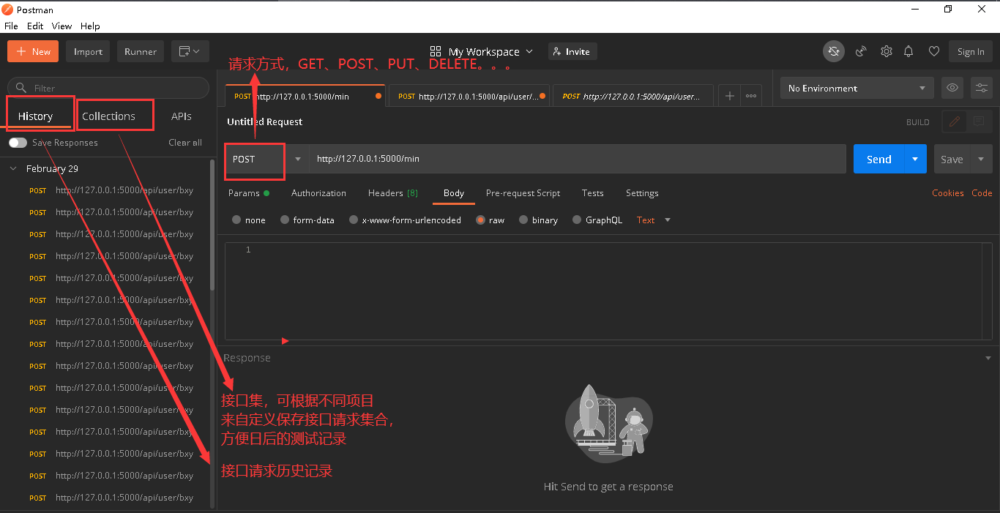
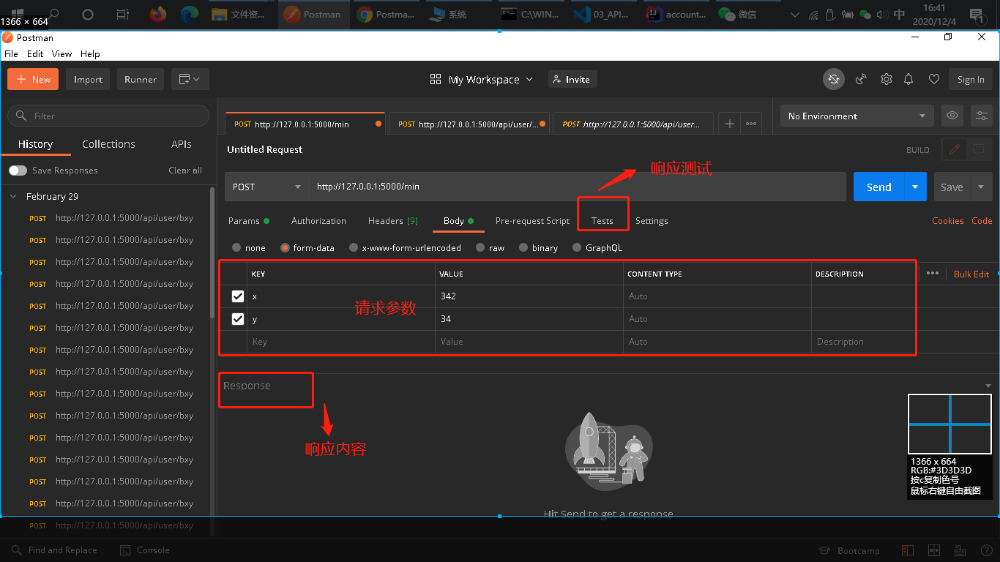

[TOC]

# API测试

## 一、API测试工具介绍

API 的测试往往是使用 API 测试工具，比如常见的命令行工具 cURL、图形界面工具 Postman 或者 SoapUI、API 性能测试的 JMeter等。

## 二、cURL安装及环境配置
[参考cURL配置及详细学习使用CSDN链接](https://blog.csdn.net/hadues/article/details/101788327)

[官方文档](https://www.gitbook.com/?utm_source=legacy&utm_medium=redirect&utm_campaign=close_legacy)

[Github主页](https://github.com/bagder/everything-curl)

[关于Curl 如何使用HTTP：官方文档](https://ec.haxx.se/http)

[cURL下载链接](https://curl.haxx.se/download.html)

windows下载：


- 新建系统变量：

```bash
CURL_HOME
F:\cURL\curl-7.73.0
```



- 双击Path中添加这个环境变量:

```bash
%CURL_HOME%\bin\
```


- 查看是否安装成功

```bash
curl --version
或
curl -v / --version

```



- 查看参数

```bash
curl --help

C:\Users>curl --help
Usage: curl [options...] <url>
     --abstract-unix-socket <path> Connect via abstract Unix domain socket
     --anyauth       Pick any authentication method
 -a, --append        Append to target file when uploading
     --basic         Use HTTP Basic Authentication
     --cacert <CA certificate> CA certificate to verify peer against
     --capath <dir>  CA directory to verify peer against
 -E, --cert <certificate[:password]> Client certificate file and password
     --cert-status   Verify the status of the server certificate
     --cert-type <type> Certificate file type (DER/PEM/ENG)
     --ciphers <list of ciphers> SSL ciphers to use
     --compressed    Request compressed response
```

## 三、cURL测试

### 1、通过以下命令发起 Account API 的调用

```bash
curl -i -H "Accept: application/json" -X GET "http://127.0.0.1:8080/account/ID008"

# 结果显示：
C:\Users\Gaoyu>curl -i -H "Accept: application/json" -X GET "http://127.0.0.1:8080/account/ID008"
HTTP/1.1 200
Content-Type: application/json;charset=UTF-8
Transfer-Encoding: chunked
Date: Fri, 04 Dec 2020 07:44:08 GMT

{"id":"ID008","type":"friends","email":"tom@api.io"}
```

```bash
这行命令中参数的含义如下：

第一个参数“-i”，说明需要显示 response 的 header 信息；
第二个参数“-H”，用于设定 request 中的 header；
第三个参数“-X”，用于指定执行的方法，这里使用了 GET 方法，其他常见的方法还有 POST、PUT 和 DELETE 等，如果不指定“-X”，那么默认的方法就是 GET。
最后“ http://127.0.0.1:8080/account/ID008 ”，指明了被测 API 的 endpoint 以及具体的 ID 值是“ID008”。
当使用 cURL 进行 API 测试时，常用参数还有两个：

“-d”：用于设定 http 参数，http 参数可以直接加在 URL 的 query string，也可以用“-d”带入参数。参数之间可以用“&”串接，或使用多个“-d”。
“-b”：当需要传递 cookie 时，用于指定 cookie 文件的路径。

需要注意的是这些参数都是大小写敏感的。
```

### 2、session场景

如果后端工程师使用 session 记录使用者登入信息，那么后端通常会传一个 session ID 给前端。之后，前端在发给后端的 requests 的 header 中就需要设置此 session ID，后端便会以此 session ID 识别出前端是属于具体哪个 session，此时 cURL 的命令行如下所示：

```bash
curl -i -H "sessionid:XXXXXXXXXX" -X GET "http://XXX/api/demoAPI"
```

### 3、cookie场景

成为文件，当需要再次使用该 cookie 时，再用“-b cookie_File” 的方式在 request 中植入 cookie 即可正常使用。具体的 cURL 的命令行如下所示：

```bash
# 将 cookie 保存为文件
curl -i -X POST -d username=robin -d password=password123 -c ~/cookie.txt "http://XXX/auth"
 
# 载入 cookie 到 request 中
curl -i -H "Accept:application/json" -X GET -b ~/cookie.txt "http://XXX/api/demoAPI"
```

cURL 只能发起 API 调用，而其本身并不具备结果验证能力（结果验证由人完成）

## 四、Postman测试

### 1、Postman下载及安装

[Postman下载链接](https://app.getpostman.com/app/download/win64)

[Postman学习链接](https://www.jianshu.com/p/97ba64888894)

- 下载完成后，双击即可安装


### 2、Postman使用

[Postman官方学习文档](https://learning.postman.com/docs/sending-requests/intro-to-collections/)

- Settings更改主题色为黑色



- Postman界面介绍



