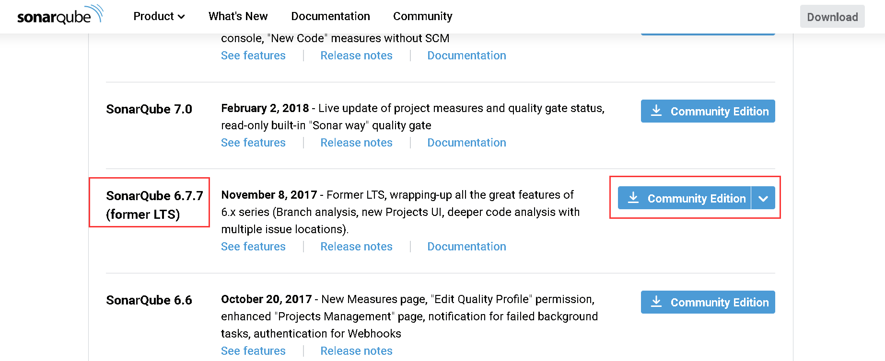
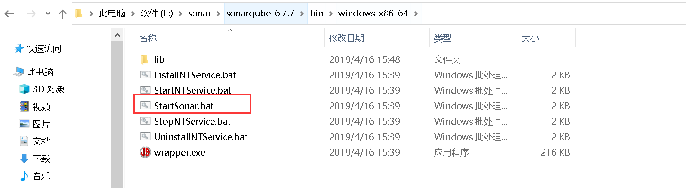
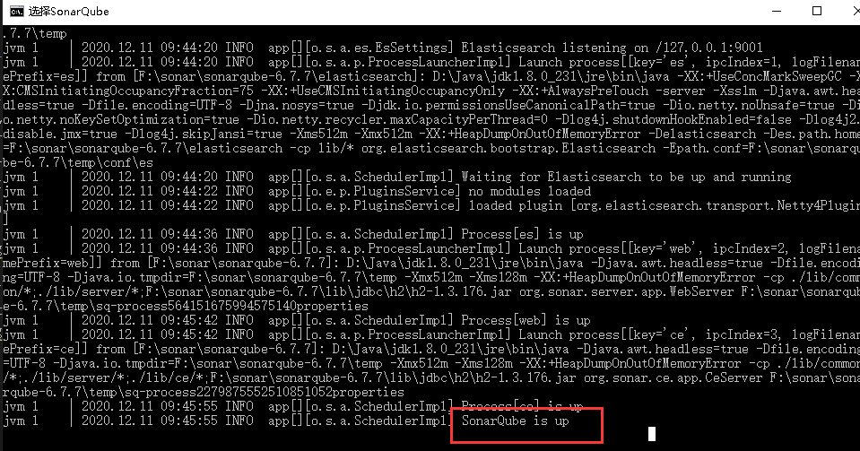
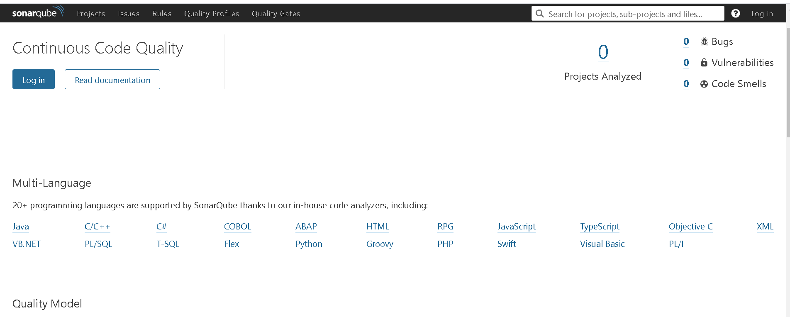
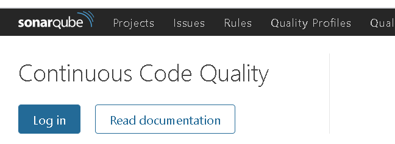
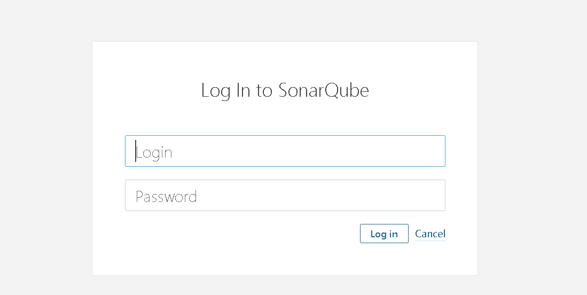

# 基于代码API测试

基于 Java 的 OkHttP 和 Unirest、基于 Python 的 http.client 和 Requests、基于 NodeJS 的 Native 和 Request 等。

## Sonar下载及安装

[Sonar官方下载链接](https://www.sonarqube.org/downloads/)

- 建议使用LTS（Long-term Support）版本，保持稳定性和兼容性，不推荐下载最新版本SonarQube。注意：此处目前下载最新版，SonarQube 7.9.x LTS，不支持java 11，因此下载了SnoarQube 6.7.7（from LTS）版本。

- 下载完成后，解压缩直接可以使用，找到对应版本，打开bin目录下的StartSonar.bat，双击。

- 显示SonarQube is up 即启动成功。

- 浏览器打开：http://localhost:9000/about，可以进入web页面

## Sonar使用

### Sonar注册

- 左上角Log 进行注册

