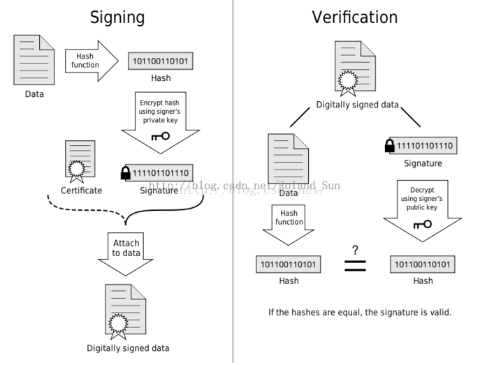

#

## 如何查看App的签名信息

- 解压缩apk包，后可看到META-INF文件夹中有CERT.RSA文件
-  CERT.RSA就包含签名信息

cmd 命令框中输入

```bash
C:\Users>keytool -printcert -file D:\Users\Gaoyu\Desktop\Test\Bayge_v1.2.1_2021-01-26-16-14_baidu\META-INF\CERT.RSA

所有者: C=China
发布者: C=China
序列号: 7989e4b
有效期为 Wed Jul 05 16:23:45 CST 2017 至 Fri Jun 11 16:23:45 CST 2117
证书指纹:
         MD5:  BC:2A:72:2B:83:EC:4F:8D:92:87:A7:4C:27:72:BF:FD
         SHA1: B2:0D:80:5C:AA:DD:8F:7F:97:5F:3F:14:87:B1:36:E6:B2:E6:3C:1D
         SHA256: C6:4H:E9:UI:AE:84:42:9F:0B:89:59:3E:8F:EF:DE:34:26:EF:18:51:EF:8A:4A:A8:1A:DB:30:B9:A6:31:AB:F2
签名算法名称: SHA256withRSA
主体公共密钥算法: 2048 位 RSA 密钥
版本: 3

扩展:

#1: ObjectId: 2.5.29.14 Criticality=false
SubjectKeyIdentifier [
KeyIdentifier [
0000: 3E A9 B7 A1 03 2A 37 7C   EF 19 5F 99 AE 86 E8 BA  >....*7..._.....
0010: 97 01 99 84                                        ....
]
]
```

## 数字证书

> 一般包含以下一些内容：
证书的发布机构（Issuer）
证书的有效期（Validity）
消息发送方的公钥
证书所有者（Subject）
数字签名所使用的算法
数字签名

数字签名和签名验证的大体流程如下图所示：



[APP签名原理详解见此链接（包括META-INF文件中的三个文档详解）](https://www.jianshu.com/p/76e5f5e64b85)