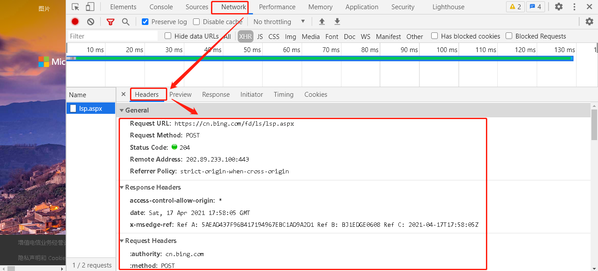
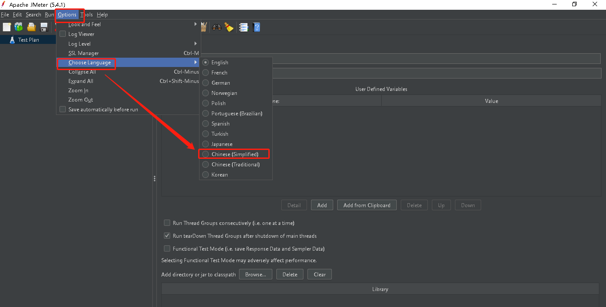
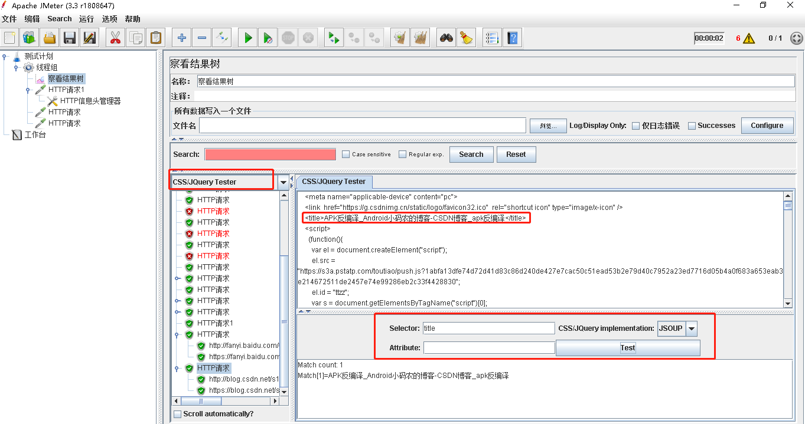

#

##

###

[JMeter官方学习文档](https://jmeter.apache.org/usermanual/get-started.html)

[HTTP响应头和请求头信息对照表](http://tools.jb51.net/table/http_header)

F12可看到浏览器的信息


JMeter汉化：


JMeter察看结果树—CSS JQuery查找特定值：
- Selector->test

```bash
div[div[class="article-title-box"]]
```
