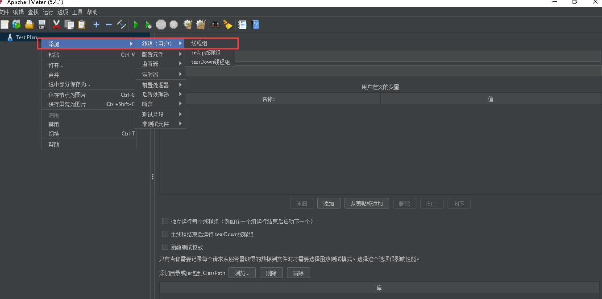
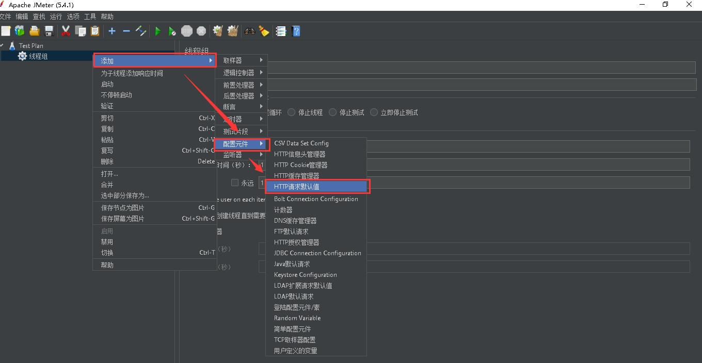
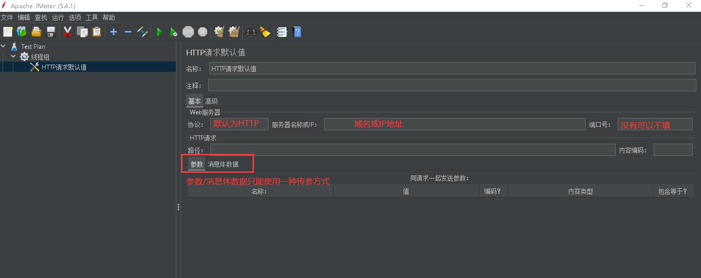
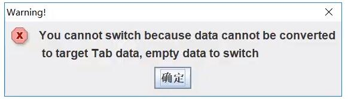
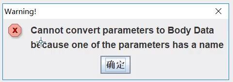
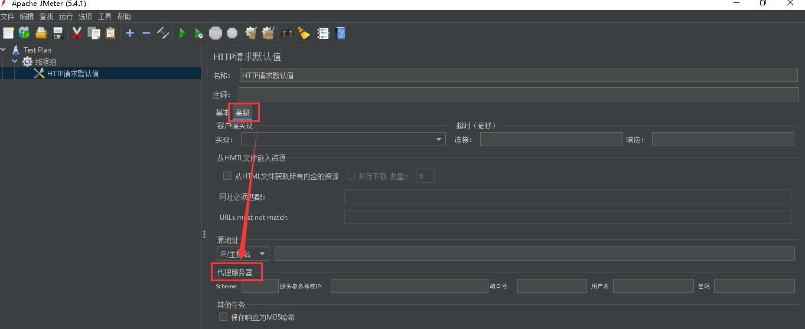
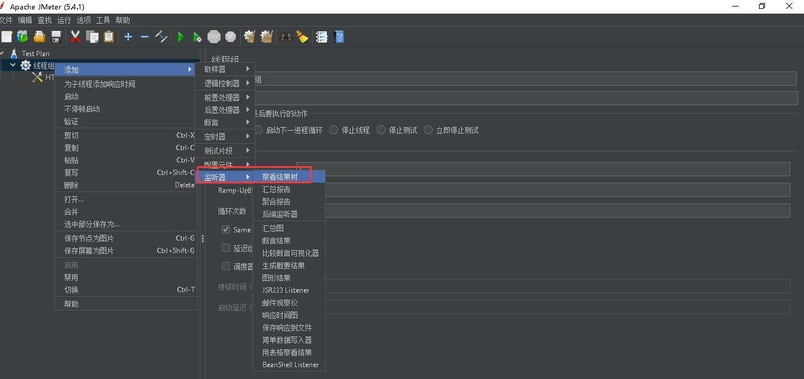
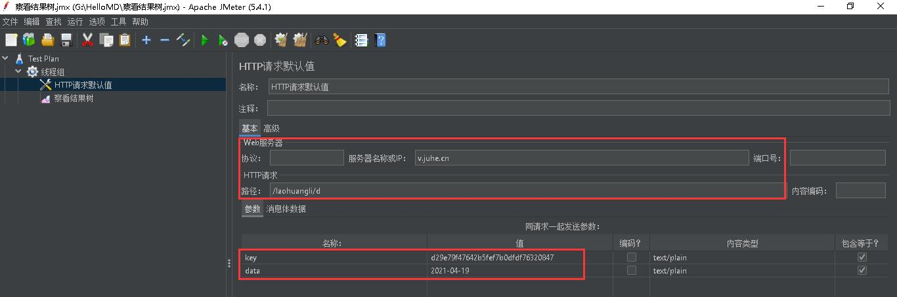
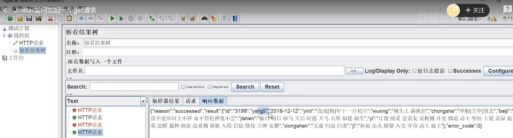

# Jmeter添加HTTP的GET请求

- 添加线程组

- 发起HTTP请求

- HTTP请求参数

  - 注：默认为HTTP协议，可以不填
  - 参数（paramters）注意空格，域名的斜杠不能掉
  - 参数/消息体数据（bodydata）传参方式只能选一个。否则报错。消息体数据（bodydata）可传json、xml
  - 
  - 

- 添加代理
 
  
- 监听器->添加查看结果树
  

- 添加HTTP的GET请求
[点此查看测试接口](https://www.juhe.cn/docs/api/id/65)
  

- 结果响应
  