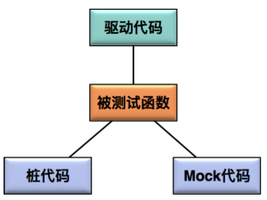

# 1

[TOC]

## 2

### 单元测试

> 单元测试是指，对软件中的最小可测试单元在与程序其他部分相隔离的情况下进行检查和验证的工作，这里的最小可测试单元通常是指函数或者类。单元测试的用例是一个“输入数据”和“预计输出”的集合。

- 输入数据

> 被测试函数的输入参数；
被测试函数内部需要读取的全局静态变量；
被测试函数内部需要读取的成员变量；
函数内部调用子函数获得的数据；
函数内部调用子函数改写的数据；
嵌入式系统中，在中断调用时改写的数据；
…

- 预计输出

> 被测试函数的返回值；
被测试函数的输出参数；
被测试函数所改写的成员变量；
被测试函数所改写的全局变量；
被测试函数中进行的文件更新；
被测试函数中进行的数据库更新；
被测试函数中进行的消息队列更新；



- 驱动代码

> 驱动代码（Driver）指调用被测函数的代码，在单元测试过程中，驱动模块通常包括调用被测函数前的数据准备、调用被测函数以及验证相关结果三个步骤。

- 桩代码（Stub）是用来代替真实代码的临时代码。
- Mock 代码和桩代码非常类似，都是用来代替真实代码的临时代码，起到隔离和补齐的作用。

### 连接数据库

 ```java
private static final String URL="jdbc:mysql://localhost:3306/demo_jdbc";
private static final String NAME="root";
private static final String PASSWORD="root";
 ```

### 测试范围及内容

- 功能测试
- 兼容性测试

> （Web 测试需要确定覆盖的浏览器类型和版本，移动设备测试需要确定覆盖的设备类型和具体 iOS/Android 的版本），如果是既有产品，你可以通过大数据技术分析产品的历史数据得出 Top 30% 的移动设备以及 iOS/Android 的版本列表，那么兼容性测试只需覆盖这部分即可。如果是一个全新的产品，你可以通过 TalkingData 这样的网站来查看目前主流的移动设备，分辨率大小、iOS/Android 版本等信息来确定测试范围。

- 性能测试

> 需要在明确了性能需求（并发用户数、响应时间、事务吞吐量等）的前提下，结合被测系统的特点，设计性能测试场景并确定性能测试框架。

- 接口测试
- 集成测试
- 安全测试
- 容量验证
- 安装测试
- 故障恢复测试
- 互联网产品功能测试以外的其他测试，比如性能测试、稳定性测试、全链路压测、故障切换（Failover）测试、动态集群容量伸缩测试、服务降级测试和安全渗透测试等，就要掌握网站的架构知识

### 具备能力

- 测试工程师要具备的七项核心竞争力，包括：测试策略设计能力、测试用例设计能力、快速学习能力、探索性测试思维、缺陷分析能力、自动化测试技术和良好的沟通能力。
- 测试开发工程师来说，你需要具备优秀的测试系统需求分析能力和完备的知识体系

### 专业技术

- 小到 Linux/Unix/Windows 操作系统的基础知识，Oracle/MySQL 等传统关系型数据库技术，NoSQL 非关系型数据库技术，中间件技术，Shell/Python 脚本开发，版本管理工具与策略，CI/CD 流水线设计，F5 负载均衡技术，Fiddler/Wireshark/Tcpdump 等抓包工具，浏览器 Developer Tool 等；
- 大到网站架构设计，容器技术，微服务架构，服务网格（Service Mesh），DevOps，云计算，大数据，人工智能和区块链技术等。

### 非专业技术

- 网站架构、容器技术、云计算技术、DevOps 思维，以及前端开发技术的核心知识以及实践
- 网站高性能架构设计、网站高可用架构设计、网站伸缩性架构设计和网站可扩展性架构设计，为你详细讲解互联网架构的核心知识，提升你的互联网产品测试能力。
- 容器技术（熟练使用 VMware 一样，掌握 Docker 和 Kubernetes 的原理和使用方法。[docs.docker](https://docs.docker.com/get-started/)、   云计算技术、DevOps 思维、前端开发技术（首先需要掌握最基本的 JavaScript、CSS、JQuery 和HTML5 等知识，然后再去学习一些主流的前端开发框架，比如 Angular.js、Backbone.js等。 Node.js 的生态圈）

### 模块化思想

把一些通用的操作集合打包成一个个名字有意义的函数，然后 GUI 自动化脚本直接去调用这些操作函数来构成整个测试用例

# 页面对象（Page Object）模型

页面对象模型的核心理念是，以页面（Web Page 或者 Native App Page）为单位来封装页面上的控件以及控件的部分操作。

# 操作函数的粒度

一个操作函数到底应该包含多少操作步骤才是最合适的。

# 选择什么时机创建测试数据

1、对于相对稳定、很少有修改的数据，建议采用 Out-of-box 的方式，比如商品类目、厂商品牌、部分标准的卖家和买家账号等。

2、对于一次性使用、经常需要修改、状态经常变化的数据，建议使用 On-the-fly 的方式。

3、用 On-the-fly 方式创建测试数据时，上游数据的创建可以采用 Out-of-box 方式，以提高测试数据创建的效率。以订单数据为例，订单的创建可以采用 On-the-fly 方式，而与订单相关联的卖家、买家和商品信息可以使用 Out-of-box 方式创建。

# GUI 测试不稳定的因素（3.17）

非预计的弹出对话框；
页面控件属性的细微变化；
被测系统的 A/B 测试；
随机的页面延迟造成控件识别失败；
测试数据问题。

# Jest
Jest 是由 Facebook 发布的，是一个基于 Jasmine 的开源 JavaScript 单元测试框架，是目前主流的 JavaScript 单元测试方案。

1、先构建一个空页面，并加入被测控件，由此可以构建出一个包含被测控件的测试页面，这个页面往往被称为 Dummy Page；

2、从黑盒的角度出发，在这个测试页面上通过手工和自动化的方式操作被测控件，并验证其功能的正确性。

# 名称

QTP（Quick Test Professional，现在已经改名为 Unified Functional Testing）开发

端到端（E2E）

及业务流程（business flow）

代码库（Repository）
